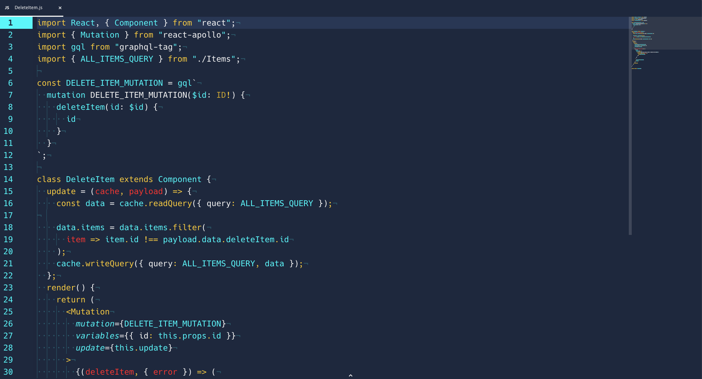

# Nautilus Syntax

A dark theme based off Zambumon's [Nautilus keycap set](https://drop.com/buy/massdrop-x-zambumon-gmk-nautilus-custom-keycap-set?mode=guest_open/).

# Installation

On your console:

```
apm install nautilus-syntax
```

or install via Atom's settings install tab.

Works great when paired with a dynamic UI theme like [Kecleon UI](https://github.com/arturoalviar/atom-kecleon-ui).

```
apm install kecleon-ui
```

# Screenshots


